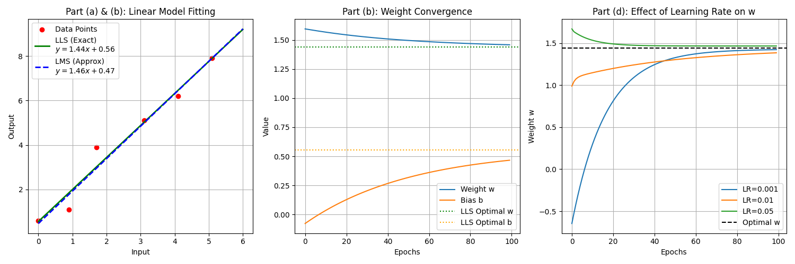
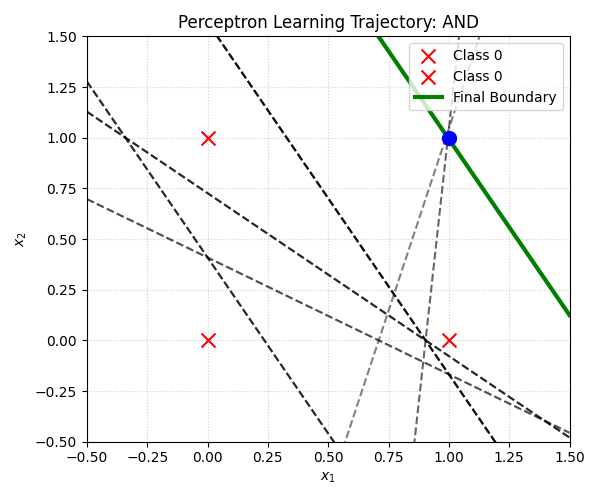
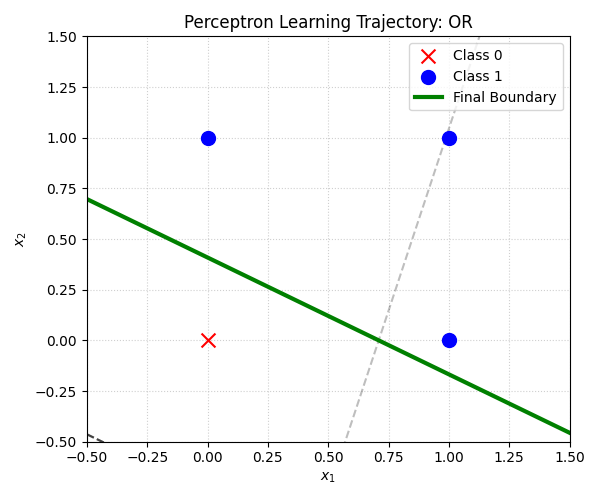
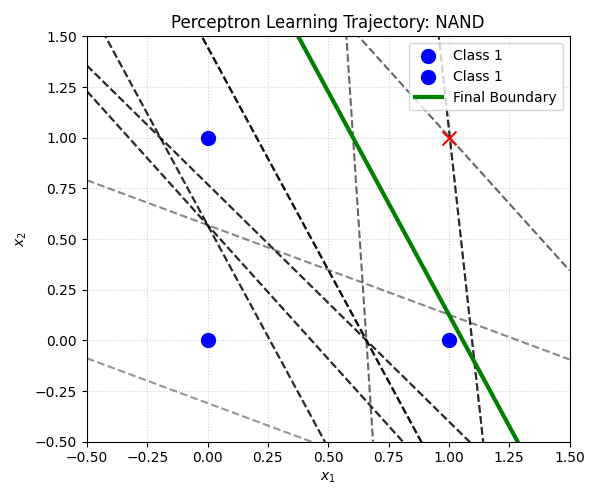
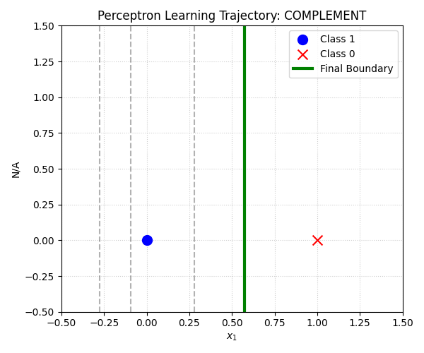

# EE5904 Neural Networks - Homework 1

## Linear Regression

Linear Least Squares (LLS) and Least Mean Squares (LMS) implementation.

### Formulas

**Linear Least Squares (Closed-form solution):**

$$\mathbf{w} = (X^T X)^{-1} X^T \mathbf{y}$$

**Least Mean Squares (Gradient descent update):**

$$w \leftarrow w + \eta \cdot e \cdot x$$
$$b \leftarrow b + \eta \cdot e$$

where $e = y - \hat{y}$ is the prediction error and $\eta$ is the learning rate.

## Perceptron

A simple perceptron implementation for logic gates (AND, OR, NAND, COMPLEMENT, XOR).

### Formula

$$y = \begin{cases} 1 & \text{if } \sum w_i x_i + b \geq 0 \\ 0 & \text{otherwise} \end{cases}$$

**Weight update rule:**

$$w_i \leftarrow w_i + \eta \cdot (t - y) \cdot x_i$$
$$b \leftarrow b + \eta \cdot (t - y)$$

where $t$ is the target output and $y$ is the predicted output.

| AND | OR |
|:---:|:---:|
|  |  |

| NAND | XOR | COMPLEMENT |
|:---:|:---:|:---:|
|  |  |  |
